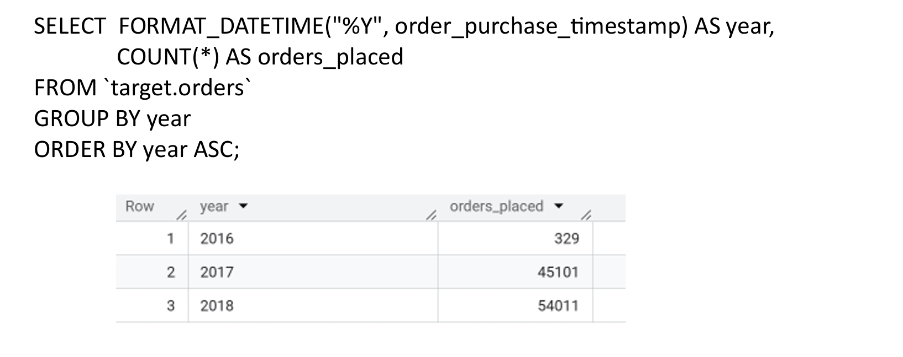
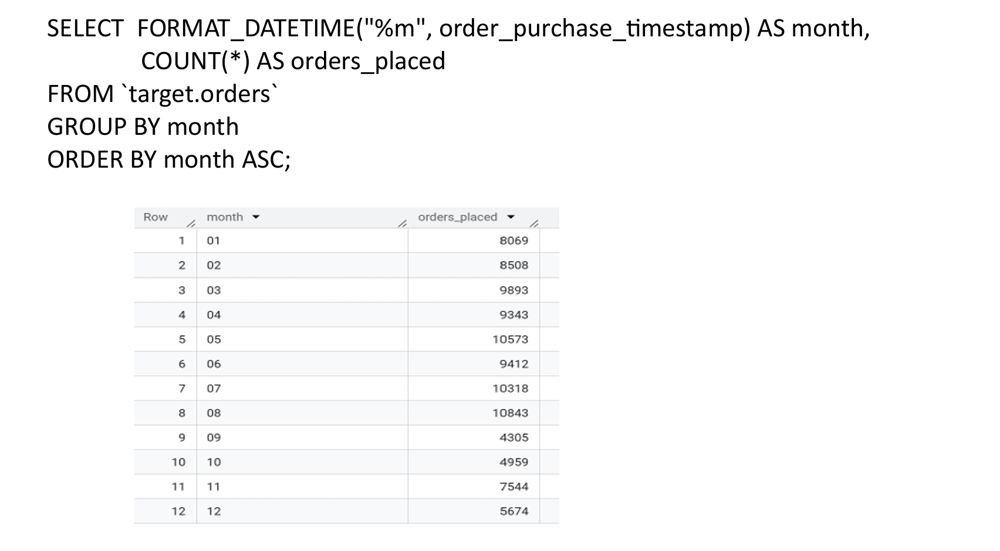
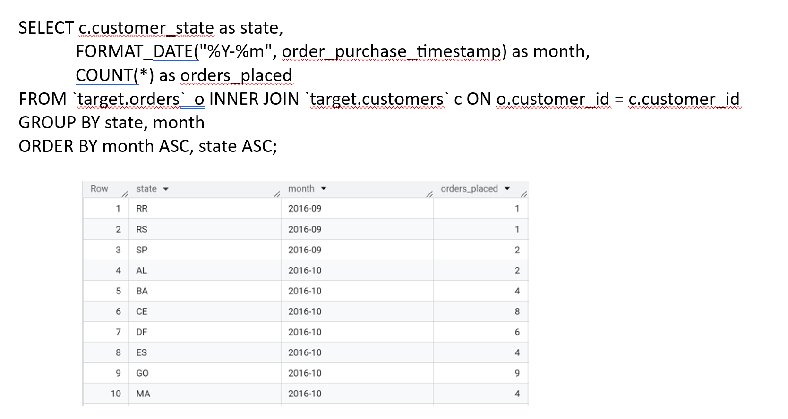
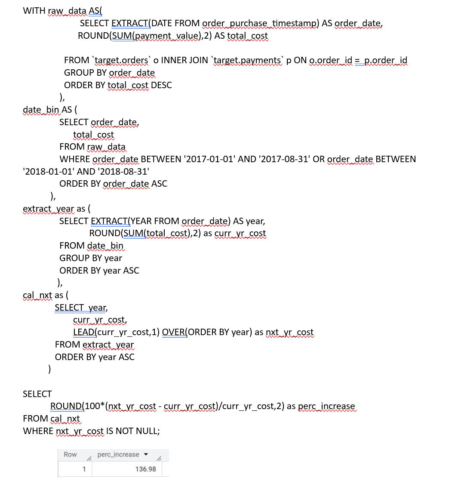
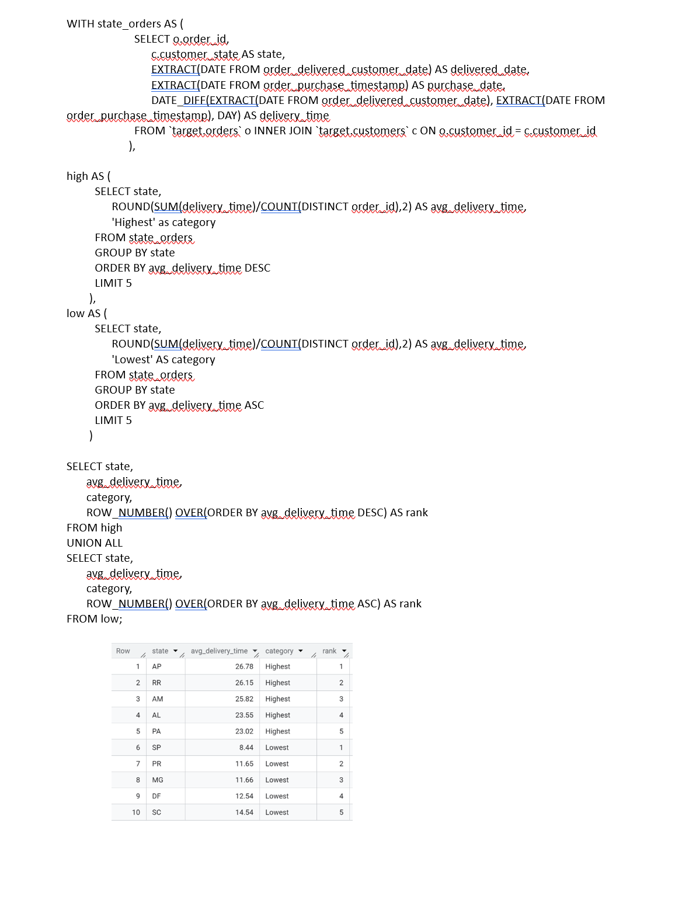
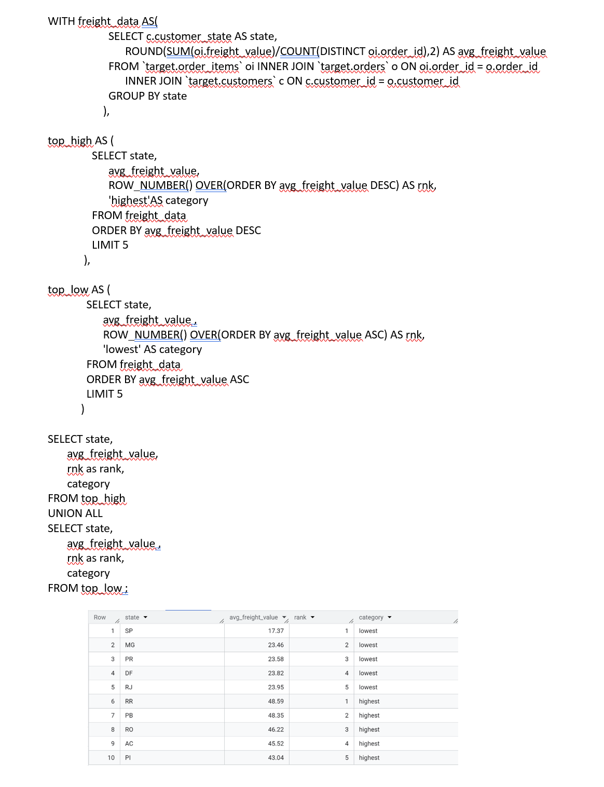

# Target Brazil E-Commerce Operations Analysis

## Overview

This project analyzes over 100,000 e-commerce transactions from the Brazilian E-Commerce Public Dataset using SQL and Google BigQuery. The objective was to uncover customer behavior patterns, sales trends, delivery performance metrics, and payment preferences to support business decision-making.

## Tools & Technologies

- SQL
- Google BigQuery
- Common Table Expressions (CTEs)
- Window Functions
- Aggregate Functions
- Date Functions

## Business Problems Addressed

### Customer & Market Analysis
- Customer distribution across Brazilian states
- Regional growth trends
- Order volume evolution

### Sales Analysis
- Year-over-year revenue growth
- Average order value by state
- Freight cost analysis

### Operations Analysis
- Delivery performance evaluation
- Estimated vs Actual delivery comparison
- State-level logistics performance

### Payment Analysis
- Payment type preferences
- Installment usage behavior

---

## Analysis 1: Order Growth Trend

### Business Question
Is there a growing trend in the number of orders placed over the years?



### Key Insight
- Order volume increased significantly from 2016 to 2018.
- Indicates growing customer adoption of e-commerce.
- Supports business expansion and inventory planning decisions.

---

## Analysis 2: Monthly Seasonality

### Business Question
Can we observe seasonality in customer orders?



### Key Insight
- August recorded the highest order volume.
- September showed the lowest activity.
- Seasonal demand patterns can help optimize inventory allocation and promotional campaigns.

---

## Analysis 3: Customer Distribution by State

### Business Question
How are customers distributed across Brazilian states?



### Key Insight
- São Paulo (SP) has the largest customer base.
- Customer demand is concentrated in a few key states.
- Regional insights can support targeted marketing and operational planning.

---

## Analysis 4: Revenue Growth

### Business Question
What was the growth in order value between 2017 and 2018?



### Key Insight
- Order value increased by approximately 137% between Jan–Aug 2017 and Jan–Aug 2018.
- Demonstrates strong growth in e-commerce adoption and customer spending.

---

## Analysis 5: Delivery Performance

### Business Question
Which states have the fastest and slowest delivery times?



### Key Insight
- Significant variation exists in delivery performance across states.
- Identifying slow-delivery regions can help improve logistics efficiency and customer satisfaction.

---

## Analysis 6: Freight Cost Analysis

### Business Question
Which states have the highest and lowest freight costs?



### Key Insight
- Freight costs vary considerably by region.
- Understanding freight trends helps optimize shipping strategies and cost management.

---

## Skills Demonstrated

- Data Cleaning
- Exploratory Data Analysis (EDA)
- SQL Query Optimization
- Joins and Multi-Table Analysis
- Common Table Expressions (CTEs)
- Window Functions
- Aggregations and Grouping
- Business Insight Generation
- Data-Driven Recommendations
- BigQuery Analytics

---

## Repository Structure

```text
target-brazil-ecommerce-analysis
│
├── README.md
│
├── Project_Report
│   └── Target_Brazil_Analysis.pdf
│
├── SQL_Queries
│   ├── 01_exploratory_analysis.sql
│   ├── 02_order_trends.sql
│   ├── 03_customer_distribution.sql
│   ├── 04_revenue_analysis.sql
│   ├── 05_delivery_analysis.sql
│   └── 06_payment_analysis.sql
│
└── Screenshots
    ├── 01_order_growth.png
    ├── 02_monthly_seasonality.png
    ├── 03_customer_distribution.png
    ├── 04_revenue_growth.png
    ├── 05_delivery_time_analysis.png
    └── 06_freight_analysis.png
```

---

## Dataset

**Brazilian E-Commerce Public Dataset **

The dataset contains approximately 100,000 e-commerce orders placed in Brazil between 2016 and 2018. It includes customer, order, payment, product, seller, and logistics information, enabling end-to-end business and operational analysis.

---

## Author

**Prabhakar Ramkumar**

Data Analyst | SQL | Python | Tableau | BigQuery
